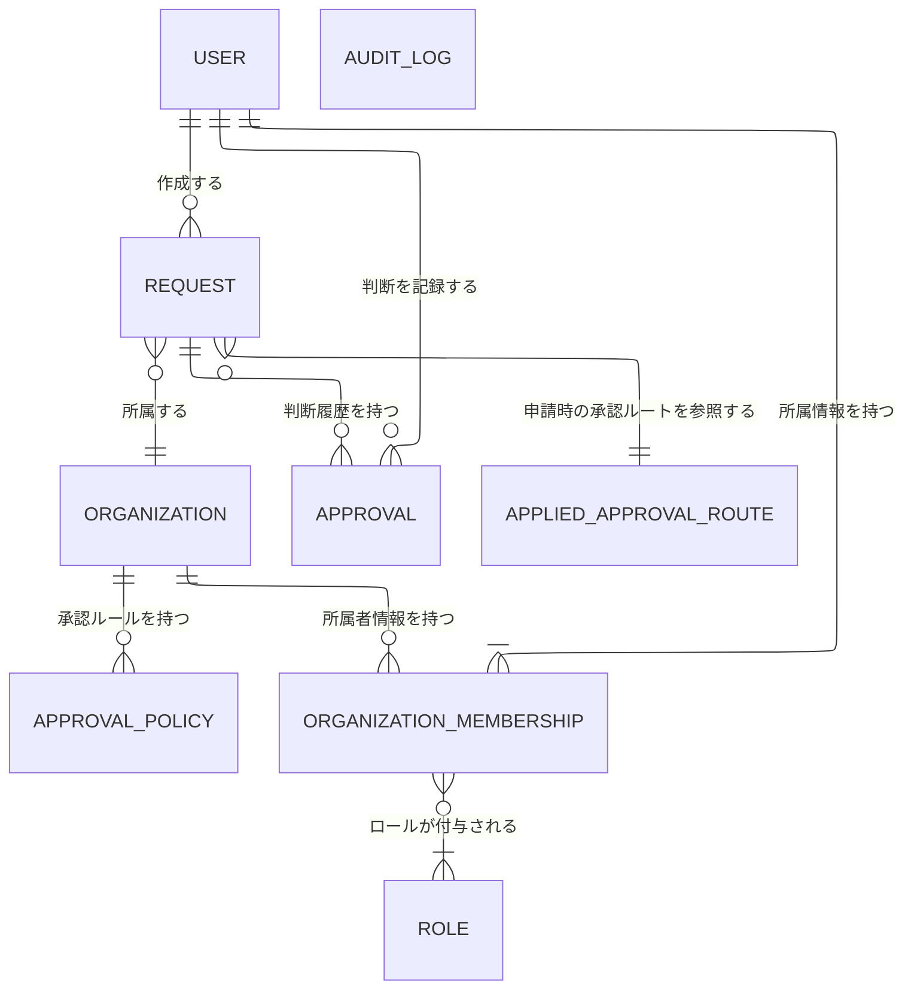

# 概念ER図ラフ

## 目的

経費申請アプリで扱う主要な概念と、その関係を確認する。  
この段階では、属性・主キー・外部キーは最小限または未記載とする。

## `AUDIT_LOG` について

`AUDIT_LOG` は、`request`、`approval`、`approval_policy`、`user` などに対する重要操作を記録する独立概念である。  
この概念ER図では、通常の親子関係のように線を引くと誤解を招きやすいため、関係線は描かない。

## `APPLIED_APPROVAL_ROUTE` について

`APPLIED_APPROVAL_ROUTE` は、`request` 作成時に `approval_policy` を評価して確定した承認ルートの保存結果である。  
現時点では、どの単位で保存するかが未確定であるため、この概念ER図では `REQUEST` との関係だけを描き、`APPROVAL_POLICY` や `ORGANIZATION` との直接関係は描かない。

