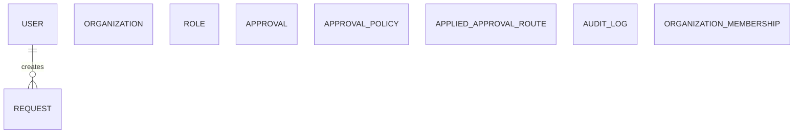

# 概念ER図ラフ

## 目的
経費申請アプリにおける主要概念と関係を確認する。
この段階では、属性・主キー・外部キーは最小限または未記載とする。

```mermaid
---
config:
  layout: elk
---
erDiagram
  USER
  ORGANIZATION
  ROLE
  REQUEST
  APPROVAL
  APPROVAL_POLICY
  APPLIED_APPROVAL_ROUTE
  AUDIT_LOG
  ORGANIZATION_MEMBERSHIP


  USER ||--o{ REQUEST : creates


```