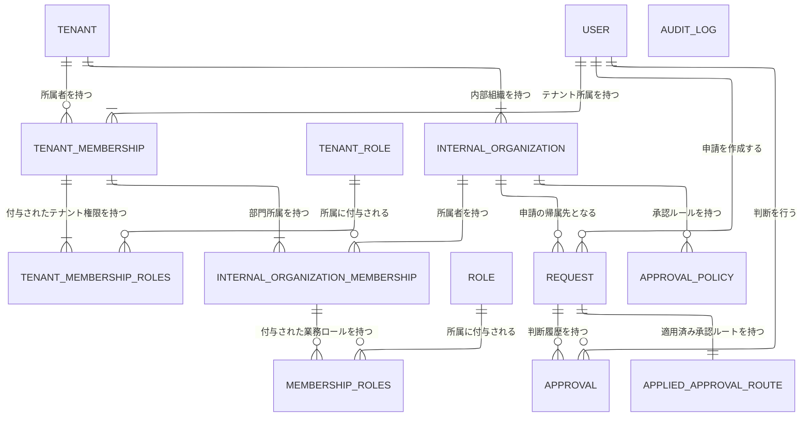

# 概念ER図ラフ

## 目的

経費申請アプリで扱う主要概念と、その関係を確認する。  
この段階では、属性・主キー・外部キーはまだ確定せず、概念の分割と関係の整理を優先する。

## `AUDIT_LOG` について

`AUDIT_LOG` は、`REQUEST`、`APPROVAL`、`APPROVAL_POLICY`、`USER` などに対する重要操作を記録する独立概念である。  
通常の親子関係として線を引くと誤解を招きやすいため、この概念ER図では関係線を描かない。

## `APPLIED_APPROVAL_ROUTE` について

`APPLIED_APPROVAL_ROUTE` は、`REQUEST` 作成時に `APPROVAL_POLICY` を評価して確定した承認ルートの保存結果である。  
実際には `APPLIED_APPROVAL_ROUTE_STEP` と `APPLIED_APPROVAL_ROUTE_STEP_APPROVER` を持つが、それらの詳細は論理ER図で扱う。  
この概念ER図では、`REQUEST` に対して適用済み承認ルートが1つ紐づくことだけを表す。

```mermaid
---
config:
  layout: elk
---
erDiagram
  TENANT
  USER
  TENANT_MEMBERSHIP
  TENANT_ROLE
  TENANT_MEMBERSHIP_ROLES

  INTERNAL_ORGANIZATION
  INTERNAL_ORGANIZATION_MEMBERSHIP
  ROLE
  MEMBERSHIP_ROLES

  REQUEST
  APPROVAL
  APPROVAL_POLICY
  APPLIED_APPROVAL_ROUTE
  AUDIT_LOG

  TENANT ||--o{ TENANT_MEMBERSHIP : 所属者を持つ
  USER ||--|{ TENANT_MEMBERSHIP : テナント所属を持つ
  TENANT_MEMBERSHIP ||--|{ TENANT_MEMBERSHIP_ROLES : 付与されたテナント権限を持つ
  TENANT_ROLE ||--o{ TENANT_MEMBERSHIP_ROLES : 所属に付与される

  TENANT ||--|{ INTERNAL_ORGANIZATION : 内部組織を持つ
  TENANT_MEMBERSHIP ||--|{ INTERNAL_ORGANIZATION_MEMBERSHIP : 部門所属を持つ
  INTERNAL_ORGANIZATION ||--o{ INTERNAL_ORGANIZATION_MEMBERSHIP : 所属者を持つ
  INTERNAL_ORGANIZATION_MEMBERSHIP ||--o{ MEMBERSHIP_ROLES : 付与された業務ロールを持つ
  ROLE ||--o{ MEMBERSHIP_ROLES : 所属に付与される

  USER ||--o{ REQUEST : 申請を作成する
  INTERNAL_ORGANIZATION ||--o{ REQUEST : 申請の帰属先となる
  REQUEST ||--o{ APPROVAL : 判断履歴を持つ
  USER ||--o{ APPROVAL : 判断を行う
  INTERNAL_ORGANIZATION ||--o{ APPROVAL_POLICY : 承認ルールを持つ
  REQUEST ||--|| APPLIED_APPROVAL_ROUTE : 適用済み承認ルートを持つ
```
